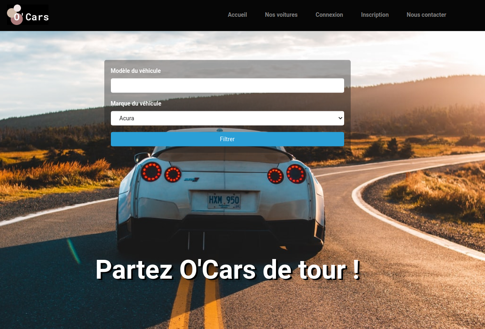

# Projet O'Cars
Site de location de voitures entre particuliers avec comme fonctionnalités principales un **système de réservation, formulaire de recherche, back-office admin personnalisée etc**.
Application réalisée en 4 semaines (*4 sprints d'1 semaine*), suivant les méthodes de gestion de projet **Agile / Scrum**.
## Récupération du projet en local

1. `git clone <projet_url>`
2. `composer install` | pour récupérer les dépendances projet (vendors...)
3. `php -S localhost:8000 -t public` pour lancer l'appli avec le serveur PHP :tada:

## Production

Site [Ocars](https://ocars.me) hébergé sur **serveur AWS** + certificat SSL (HTTPS)

## Technologies utilisées

* [Symfony](https://symfony.com/) - Framework PHP
* [Flatpickr](https://flatpickr.js.org/) - Librairie JS
* [KnpPaginatorBundle](https://github.com/KnpLabs/KnpPaginatorBundle) - Librairie Symfony de pagination
* [KnpSnappyBundle](https://flatpickr.js.org/) - Librairie Symfony pour générer les factures au format PDF

## Equipe

* **Wissem Cheriguene** - *Product Owner* -
* **Jean-Marc Catala** - *Lead Dev* -
* **Jonathan Da Mota Correia** - *Scrum Master* -
